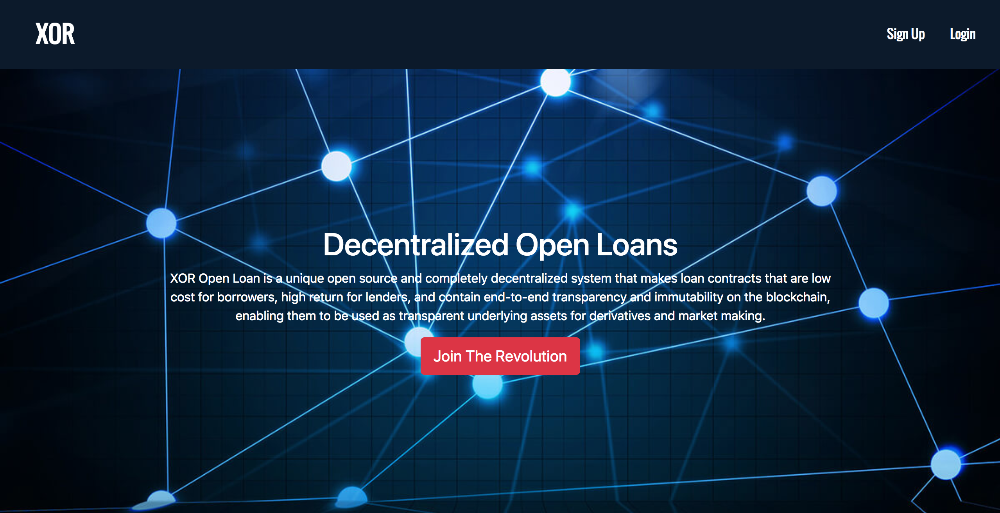
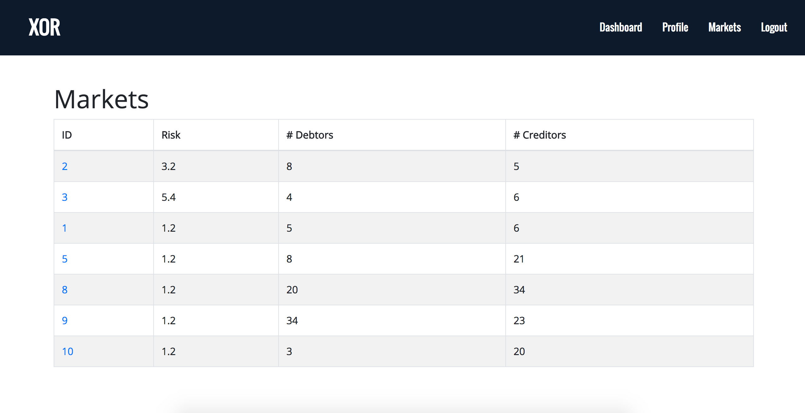
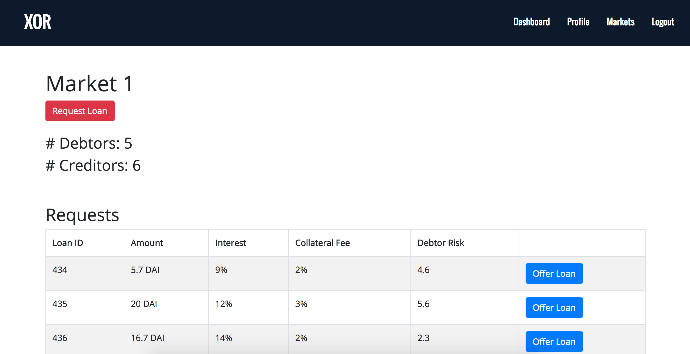

We wanted to be able to be more descriptive about our idea, so we wrote a short paper that explores the details. Please read it if you have time: https://drive.google.com/file/d/1YiwlB8AmH6hUL06Ici8tPUzjkD4MHdga/view?usp=sharing

#### High Level Overview

XOR Open Loan is a unique open source and completely decentralized system that makes loan contracts that are low cost for borrowers, high return for lenders, and contain end-to-end transparency and immutability on the blockchain. XOR Open Loan removes the middleman by allowing lenders to vet borrowers themselves with a trust system.In addition, because lenders are themselves incentivized to make a maximum return on investment, they are incentivized to make the fee-to-interest ratio on the loan as low as possible. This creates a situation where both parties get the best possible deal. The XOR Open Loan system records all loan contracts on a public ledger on the blockchain. This means that all contracts are guaranteed to be transparent. A transparent open source loan contract allows for the possibility of infinite numbers of derivative markets based on those debt obligations that can be created by anyone with internet access. Thus, we can enable access to credit, leverage, and market-making to the whole world, and the possibilities are endless.

#### Technical Specifications

We used a backend with node.js, a frontend with React, and blockchain code on Solidity. We also used Dharma's API js plugin and Dharma base level contracts.

Using React, we created a simple UI where one can access the mock debt obligation market. The UI interfaces with the Solidity code and the Dharma contracts to form a small POC simulation. We spent a huge amount of time trying to work through Dharma, so we were unable to fully interface Solidity with the UI directly. However, we progressed greatly with Dharma and filled out the logical functionality of the loan paradigm. 

Programming aside, the real technical challenge was in coming up with intelligent mechanisms to produce optimality in our system. The choices in the governance of funds are immutable once they are uploaded, so we took care to make them relatively foolproof. In addition, we were careful to avoid any sort of central authority. We made the loan underwriters the loaners themselves so as to avoid a third party with a conflict of interest. 

Here, we show our splash page. 

This is a window showing markets with their measured risks, number of debtors, number of creditors, and market ID. This is all the public information that is necessary to identify a market, besides the information of the constituents of the market. From this screen, a participant can pick the optimal market to either put bids in or to place a request in. 

This screen shows an example market that a creditor can participate in. In this implementation, the lender is a naive human being that pushes a button to place a bid for a loan. He then creates his offer and uses that with the bid. 

